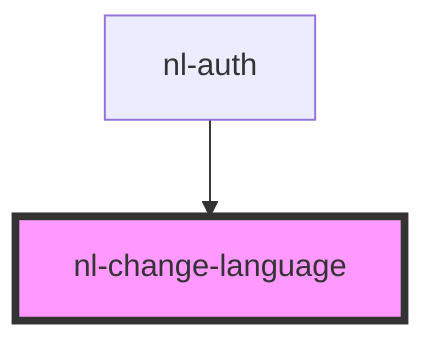

# nl-change-language

<!-- Auto Generated Below -->

## Properties

| Property   | Attribute   | Description | Type                                                       | Default     |
| ---------- | ----------- | ----------- | ---------------------------------------------------------- | ----------- |
| `darkMode` | `dark-mode` |             | `boolean`                                                  | `false`     |
| `theme`    | `theme`     |             | `"crab" \| "default" \| "lemonade" \| "ocean" \| "purple"` | `'default'` |

## Events

| Event                  | Description | Type                  |
| ---------------------- | ----------- | --------------------- |
| `handleLanguageChange` |             | `CustomEvent<string>` |

## Dependencies

### Used by

- [nl-auth](../nl-auth)

### Graph

---

_Built with [StencilJS](https://stenciljs.com/)_
