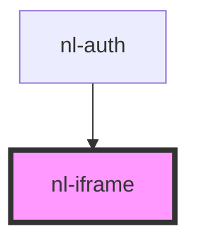

# nl-iframe

<!-- Auto Generated Below -->

## Properties

| Property    | Attribute    | Description | Type     | Default |
| ----------- | ------------ | ----------- | -------- | ------- |
| `iframeUrl` | `iframe-url` |             | `string` | `''`    |

## Events

| Event          | Description | Type               |
| -------------- | ----------- | ------------------ |
| `nlCloseModal` |             | `CustomEvent<any>` |

## Dependencies

### Used by

 - [nl-auth](../nl-auth)

### Graph

----------------------------------------------

*Built with [StencilJS](https://stenciljs.com/)*
