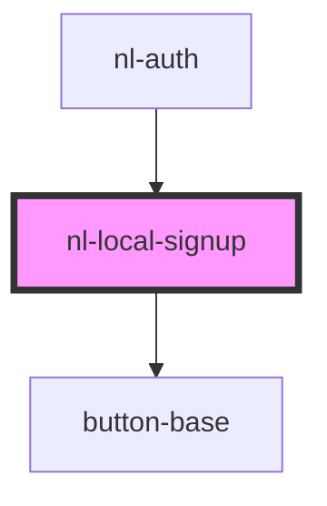

# nl-local-signup

<!-- Auto Generated Below -->

## Properties

| Property      | Attribute      | Description | Type      | Default |
| ------------- | -------------- | ----------- | --------- | ------- |
| `signupNjump` | `signup-njump` |             | `boolean` | `false` |

## Events

| Event           | Description | Type                   |
| --------------- | ----------- | ---------------------- |
| `fetchHandler`  |             | `CustomEvent<boolean>` |
| `nlLocalSignup` |             | `CustomEvent<string>`  |
| `nlSignupNjump` |             | `CustomEvent<void>`    |

## Dependencies

### Used by

- [nl-auth](../nl-auth)

### Depends on

- [button-base](../button-base)

### Graph

---

_Built with [StencilJS](https://stenciljs.com/)_
