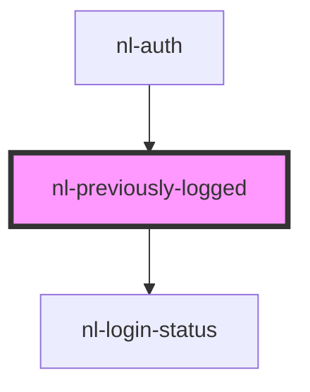

# nl-previously-logged

<!-- Auto Generated Below -->

## Properties

| Property   | Attribute | Description | Type           | Default |
| ---------- | --------- | ----------- | -------------- | ------- |
| `accounts` | --        |             | `Info[]`       | `[]`    |
| `recents`  | --        |             | `RecentType[]` | `[]`    |

## Events

| Event                  | Description | Type                                                                                                                                                                    |
| ---------------------- | ----------- | ----------------------------------------------------------------------------------------------------------------------------------------------------------------------- |
| `nlLoginRecentAccount` |             | `CustomEvent<{ name?: string; picture?: string; nip05?: string; pubkey: string; bunkerUrl?: string; authMethod: AuthMethod; domain?: string; signerPubkey?: string; }>` |
| `nlRemoveRecent`       |             | `CustomEvent<{ name?: string; picture?: string; nip05?: string; pubkey: string; bunkerUrl?: string; authMethod: AuthMethod; domain?: string; signerPubkey?: string; }>` |
| `nlSwitchAccount`      |             | `CustomEvent<Info>`                                                                                                                                                     |

## Dependencies

### Used by

- [nl-auth](../nl-auth)

### Depends on

- [nl-login-status](../nl-login-status)

### Graph

---

_Built with [StencilJS](https://stenciljs.com/)_
