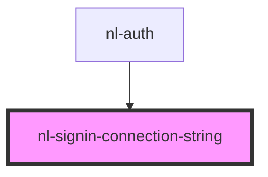

# nl-signin-connection-string

<!-- Auto Generated Below -->

## Properties

| Property           | Attribute           | Description | Type     | Default |
| ------------------ | ------------------- | ----------- | -------- | ------- |
| `connectionString` | `connection-string` |             | `string` | `''`    |

## Events

| Event                   | Description | Type                |
| ----------------------- | ----------- | ------------------- |
| `nlNostrConnectDefault` |             | `CustomEvent<void>` |

## Dependencies

### Used by

 - [nl-auth](../nl-auth)

### Graph

----------------------------------------------

*Built with [StencilJS](https://stenciljs.com/)*
