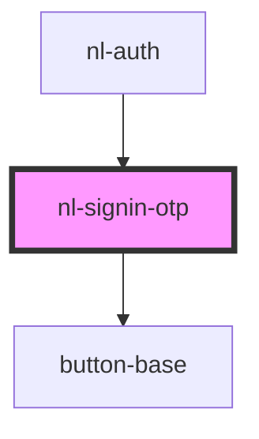

# nl-signin-otp

<!-- Auto Generated Below -->

## Events

| Event            | Description | Type                  |
| ---------------- | ----------- | --------------------- |
| `nlCheckLogin`   |             | `CustomEvent<string>` |
| `nlLoginOTPCode` |             | `CustomEvent<string>` |
| `nlLoginOTPUser` |             | `CustomEvent<string>` |

## Dependencies

### Used by

- [nl-auth](../nl-auth)

### Depends on

- [button-base](../button-base)

### Graph

---

_Built with [StencilJS](https://stenciljs.com/)_
