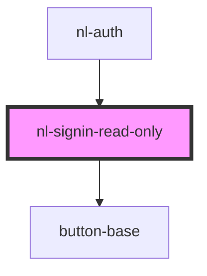

# nl-signin-read-only

<!-- Auto Generated Below -->

## Events

| Event             | Description | Type                  |
| ----------------- | ----------- | --------------------- |
| `nlCheckLogin`    |             | `CustomEvent<string>` |
| `nlLoginReadOnly` |             | `CustomEvent<string>` |

## Dependencies

### Used by

 - [nl-auth](../nl-auth)

### Depends on

- [button-base](../button-base)

### Graph

----------------------------------------------

*Built with [StencilJS](https://stenciljs.com/)*
