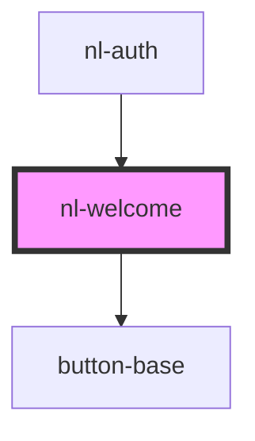

# nl-welcome

<!-- Auto Generated Below -->

## Properties

| Property       | Attribute       | Description | Type     | Default     |
| -------------- | --------------- | ----------- | -------- | ----------- |
| `description`  | `description`   |             | `string` | `undefined` |
| `titleWelcome` | `title-welcome` |             | `string` | `undefined` |

## Dependencies

### Used by

- [nl-auth](../nl-auth)

### Depends on

- [button-base](../button-base)

### Graph

---

_Built with [StencilJS](https://stenciljs.com/)_
