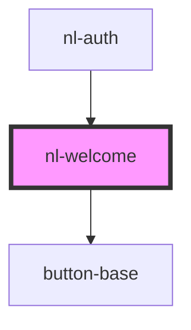

# nl-welcome

<!-- Auto Generated Below -->

## Properties

| Property       | Attribute       | Description | Type  | Default                                      |
| -------------- | --------------- | ----------- | ----- | -------------------------------------------- |
| `description`  | `description`   |             | `any` | `t('welcome.description' as TranslationKey)` |
| `titleWelcome` | `title-welcome` |             | `any` | `t('welcome.title' as TranslationKey)`       |

## Dependencies

### Used by

 - [nl-auth](../nl-auth)

### Depends on

- [button-base](../button-base)

### Graph

----------------------------------------------

*Built with [StencilJS](https://stenciljs.com/)*
